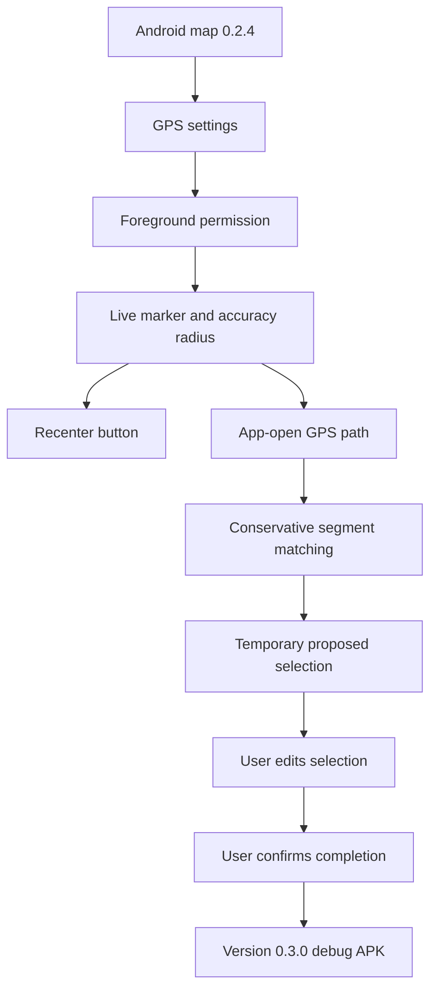

# Task 0007: Deliver Android 0.3 GPS Position and Segment Proposals

From version: 0.2.4

Status: In progress

Understanding: 94%

Confidence: 86%

Progress: 95%

Complexity: High

Theme: Android GPS

## Goal

Deliver version 0.3.0 of the Android app with foreground GPS position display,
on-demand recentering, GPS-assisted segment proposals, settings controls, and
release documentation while keeping the app local-first and manual-first.

## Links

- Request: `docs/request/0006-show-gps-position-on-map-0-3.md`
- Derived from `docs/backlog/0027-android-0-3-foreground-gps-position.md`
- Derived from `docs/backlog/0028-android-0-3-gps-path-segment-proposals.md`
- Derived from `docs/backlog/0029-android-0-3-gps-settings-and-states.md`
- Derived from `docs/backlog/0030-version-0-3-gps-release-docs-and-validation.md`
- Product brief: `docs/product/product-brief.md`
- Current handoff: `docs/development/handoff-next-codex.md`
- Current release: `docs/releases/RELEASE_0.2.4.md`
- Current Android map UI: `app/src/main/java/com/jilanos/mappingparis/ui/MappingParisApp.kt`
- Current map overlay: `app/src/main/java/com/jilanos/mappingparis/ui/ParisMapOverlays.kt`
- Android install helper: `tools/build-and-install-debug-apk.cmd`

## Context

Version 0.2.4 is a map-first manual Paris segment tracker. Version 0.3 should
add GPS as an assistive layer: the user can see where they are, recenter the
map when needed, and receive proposed covered segments from the app-open path.
GPS must not turn into automatic completion, long-term route history, cloud
sync, or background tracking.



## Scope

In:

- Add foreground Android location permission handling.
- Request location permission when the GPS feature is used.
- Show the current GPS position on the Android map while the app is open.
- Show an accuracy radius when location accuracy is available.
- Add a compact always-visible GPS button.
- Recenter the map only when the GPS button is pressed.
- Keep the live marker updating without continuously locking the camera.
- Add a settings toggle for GPS-assisted behavior.
- Keep GPS-assisted behavior off by default on first install.
- Add an adjustable GPS-to-segment matching strictness setting.
- Persist GPS settings locally.
- Capture the GPS path only while the app is open and GPS-assisted behavior is
  enabled.
- Discard the captured GPS path when the app closes.
- Match path points conservatively to logical Paris street segments.
- Select likely covered segments as editable proposals.
- Show GPS-proposed segments with a distinct temporary visual style.
- Let the user edit the proposed selection before validating completion.
- Show non-blocking denied, disabled, unavailable, and loading states.
- Bump Android version to `0.3.0` and generate
  `mapping-paris-0.3.0-debug.apk`.
- Update README, release documentation, and handoff for the 0.3 GPS behavior.

Out:

- Do not implement closed-app background location tracking.
- Do not automatically complete segments from GPS.
- Do not upload location or path data.
- Do not persist long-term route history in 0.3.
- Do not add account, backend, or cloud sync.
- Do not add GPS behavior to the PWA unless needed for documentation parity.
- Do not create release signing or Play Store publishing setup.
- Do not add a dedicated clear-proposal action; normal deselection is enough.

## Plan

- [x] Inspect the current Android map, settings, segment selection, persistence,
      snackbar, and overlay code paths.
- [x] Add foreground location permission declarations and runtime permission
      request flow for GPS usage.
- [x] Add GPS state management for permission, loading, denied, disabled,
      unavailable, and live-location states.
- [x] Render the current-position marker and optional accuracy radius in light
      and blue map modes.
- [x] Add an always-visible GPS recenter button that centers on the current
      position only when pressed.
- [x] Add GPS-assisted behavior toggle in settings, disabled by default.
- [x] Add a matching strictness setting in settings and persist both GPS
      settings locally.
- [x] Capture app-open GPS path points only while GPS-assisted behavior is
      enabled.
- [x] Implement conservative GPS path to segment proposal matching with the
      strictness setting applied.
- [x] Apply proposed segments as editable, uncompleted selections.
- [x] Add a temporary visual style for GPS-proposed segments that is distinct
      from completed and manually selected states.
- [x] Ensure the user can modify the proposed selection and only complete
      segments through the existing explicit validation action.
- [x] Bump Android version name/code for `0.3.0` and ensure the debug APK is
      named `mapping-paris-0.3.0-debug.apk`.
- [x] Update README, `docs/releases/RELEASE_0.3.0.md`, and
      `docs/development/handoff-next-codex.md`.
- [ ] Run automated validation, install on the target Pixel 8 when available,
      and complete manual GPS checks.
- [x] Update this task report with implementation notes, validation results,
      APK path, and remaining risks.

## Acceptance Criteria Traceability

- AC1: Android asks for foreground location permission when GPS is used.
  - Covered by Plan steps 2, 3, 15.
- AC2: If permission is granted, the current GPS position appears on the map.
  - Covered by Plan steps 3, 4, 15.
- AC3: A GPS button recenters the map on the current position.
  - Covered by Plan steps 5, 15.
- AC4: The marker updates while the app is open without continuous camera
  locking.
  - Covered by Plan steps 3, 4, 5, 15.
- AC5: Accuracy radius is visible when accuracy is available.
  - Covered by Plan steps 4, 15.
- AC6: GPS-assisted behavior is off by default and controllable in settings.
  - Covered by Plan steps 6, 7, 15.
- AC7: Matching strictness is adjustable and affects proposals.
  - Covered by Plan steps 7, 9, 15.
- AC8: GPS path can propose likely covered segments.
  - Covered by Plan steps 8, 9, 10, 15.
- AC9: Proposed segments are selected for review but not completed.
  - Covered by Plan steps 10, 11, 12, 15.
- AC10: Proposed segments have a distinct temporary visual style.
  - Covered by Plan steps 11, 15.
- AC11: The user can edit proposed selections before confirming completion.
  - Covered by Plan steps 10, 12, 15.
- AC12: Permission denied, GPS disabled, GPS unavailable, and loading states are
  clear and non-blocking.
  - Covered by Plan steps 3, 15.
- AC13: Captured GPS path is discarded when the app closes.
  - Covered by Plan steps 8, 15.
- AC14: No closed-app background tracking or location upload is implemented.
  - Covered by Plan steps 2, 8, 15.
- AC15: Android version is `0.3.0`.
  - Covered by Plan step 13.
- AC16: Debug APK is named `mapping-paris-0.3.0-debug.apk`.
  - Covered by Plan steps 13, 15.
- AC17: README, release docs, and handoff document the 0.3 GPS behavior.
  - Covered by Plan steps 14, 16.

## Validation

Automated:

```powershell
git status --short --branch
py -3 tools\segment_pipeline\validate_segments.py data\generated\paris_segments.geojson
py -3 tools\segment_pipeline\validate_segments.py app\src\main\assets\paris_segments.geojson
npm run check:pwa
py -3 tools\segment_pipeline\validate_pwa.py
node --check tools\dev-server.mjs
.\gradlew.bat --no-daemon --stacktrace assembleDebug
```

APK verification:

```powershell
& "$env:LOCALAPPDATA\Android\Sdk\build-tools\35.0.0\apksigner.bat" verify --print-certs app\build\outputs\apk\debug\mapping-paris-0.3.0-debug.apk
```

Device install:

```powershell
tools\build-and-install-debug-apk.cmd
```

Manual:

- Install the 0.3 debug APK on the target Pixel 8.
- Start from a fresh install and confirm GPS-assisted behavior is disabled.
- Enable GPS-assisted behavior in settings.
- Trigger GPS usage and confirm the permission prompt appears.
- Grant permission and confirm the current-position marker appears.
- Deny permission and confirm the map remains usable with a non-blocking
  message.
- Disable Android location services and confirm the unavailable state is clear.
- Tap the GPS button and confirm the map recenters on the current position.
- Move while the app is open and confirm the marker updates without continuous
  camera recentering.
- Confirm the accuracy radius appears when accuracy is available.
- Confirm marker and proposal readability in light and blue map modes.
- Confirm likely covered segments are proposed as editable selections.
- Adjust matching strictness and confirm proposal behavior changes
  conservatively.
- Deselect or modify proposed segments before validating.
- Confirm no GPS-proposed segment becomes completed until the user explicitly
  confirms completion.
- Close and reopen the app and confirm the previous GPS path is not retained.

## Non-Goals

- Background GPS after app close.
- Automatic segment completion.
- Long-term route history.
- Cloud sync or backend storage.
- Location export.
- Play Store release setup.
- Color-blind mode.
- PWA GPS feature work.

## Report

Implemented the Android 0.3 GPS feature set.

Changed:

- Added foreground fine/coarse location permissions.
- Added a native `LocationManager` foreground tracker scoped to the Compose app
  lifecycle.
- Added a GPS button below the filter button.
- Added current-position marker and accuracy radius overlay.
- Added GPS loading, denied, and unavailable state handling with non-blocking
  UI.
- Added GPS assistance and matching strictness settings, persisted locally.
- Added app-open in-memory GPS path capture.
- Added conservative GPS path to logical-segment proposal matching.
- Added GPS-proposed segment styling distinct from completed and manual
  selection states.
- Kept GPS proposals editable and uncompleted until the existing manual
  completion action is used.
- Bumped Android to `versionName=0.3.0`, `versionCode=7`.
- Generated `app/build/outputs/apk/debug/mapping-paris-0.3.0-debug.apk`.
- Updated README, release notes, and handoff.

Validation run:

- `.\gradlew.bat --no-daemon --stacktrace :app:compileDebugKotlin --rerun-tasks`
  - BUILD SUCCESSFUL.
- `py -3 tools\segment_pipeline\validate_segments.py data\generated\paris_segments.geojson`
  - OK: 18,963 features, duplicate_id_count 0.
- `py -3 tools\segment_pipeline\validate_segments.py app\src\main\assets\paris_segments.geojson`
  - OK: 18,963 features, duplicate_id_count 0.
- `npm run check:pwa`
  - OK.
- `py -3 tools\segment_pipeline\validate_pwa.py`
  - OK.
- `node --check tools\dev-server.mjs`
  - OK.
- `.\gradlew.bat --no-daemon --stacktrace assembleDebug`
  - BUILD SUCCESSFUL.
- APK signature verification with `apksigner`
  - OK: Android Debug certificate.
- APK metadata with `aapt dump badging`
  - `versionName=0.3.0`
  - `versionCode=7`
- `git diff --check`
  - OK, with only expected CRLF conversion warnings.

Mobile install:

- Initial `cmd /c tools\build-and-install-debug-apk.cmd` run was blocked by
  `INSTALL_FAILED_UPDATE_INCOMPATIBLE` because the existing phone install had a
  different signature.
- After user approval, the existing package was uninstalled and
  `mapping-paris-0.3.0-debug.apk` was installed successfully on
  `37290DLJH004PP`.
- Installed package confirmed:
  - `versionName=0.3.0`
  - `versionCode=7`
- Follow-up GPS fix installed successfully on the same device:
  - permission request now asks for fine and coarse location;
  - either fine or approximate location is accepted;
  - matching strictness labels now show the coded meter thresholds:
    `18 m`, `28 m`, `42 m`.

User validation:

- Current GPS position display works on the Pixel 8.

Remaining manual validation:

- Test GPS-based segment proposal selection during a real commute.
