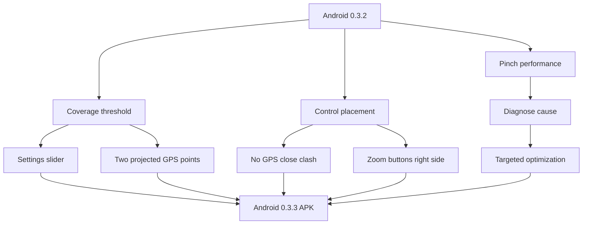

# Task 0008: Deliver Android 0.3.3 GPS QOL and Zoom Performance

From version: 0.3.2

Status: Done

Understanding: 92%

Confidence: 84%

Progress: 100%

Complexity: High

Theme: Android GPS

## Goal

Deliver the next Android prototype patch, expected `0.3.3`, with stricter
coverage-based GPS segment proposals, non-overlapping map controls, and a
diagnosed performance fix for pinch zoom lag.

## Links

- Request: `docs/request/0007-improve-gps-segment-validation-threshold-controls-and-zoom-performance.md`
- Derived from `docs/backlog/0031-gps-segment-coverage-threshold.md`
- Derived from `docs/backlog/0032-map-control-placement-and-safe-areas.md`
- Derived from `docs/backlog/0033-pinch-zoom-performance-diagnosis-and-fix.md`
- Product brief: `docs/product/product-brief.md`
- Current handoff: `docs/development/handoff-next-codex.md`
- Android UI: `app/src/main/java/com/jilanos/mappingparis/ui/MappingParisApp.kt`
- Map overlays: `app/src/main/java/com/jilanos/mappingparis/ui/ParisMapOverlays.kt`
- View model: `app/src/main/java/com/jilanos/mappingparis/ui/MappingParisViewModel.kt`
- Android install helper: `tools/build-and-install-debug-apk.cmd`

## Context

Version 0.3.2 confirms that GPS-assisted tracking can keep running while the
phone is locked. The next step is to make the GPS proposal rule less eager,
clean up map control clashes, and make pinch zoom usable on the real phone.



## Scope

In:

- Implement a GPS segment coverage threshold setting.
- Default the threshold to `70%`.
- Add a settings slider for the threshold, suggested range `30%` to `95%` with
  `5%` steps.
- Persist the threshold in local settings.
- Replace proximity-only GPS proposals with coverage-based proposals.
- Project matched GPS points onto segment geometry.
- Track min and max projected distance per logical segment during GPS tracking.
- Require at least two matched positions separated by the configured threshold
  before proposing a segment.
- Keep GPS proposals editable and uncompleted until explicit user validation.
- Prevent the GPS button from clashing with close buttons while menus or panels
  are open.
- Move plus and minus zoom controls to the right side of the map above the
  contextual bottom validation bar.
- Keep all controls safe-area compliant.
- Diagnose pinch zoom lag before optimizing.
- Investigate overlay redraw, gesture-time hit-testing or selection work,
  object resize invalidation, and osmdroid gesture behavior.
- Implement a targeted pinch zoom performance fix.
- Preserve plus and minus zoom behavior.
- Bump Android version to `0.3.3` if this work ships as the next patch.
- Build and install a debug APK on the connected Android device when available.
- Update handoff or task report with diagnosis, validation, APK path, and
  remaining risks.

Out:

- Do not change the source segment dataset.
- Do not change the map provider or replace osmdroid.
- Do not add cloud sync, backend, account, or route upload.
- Do not automatically complete segments from GPS.
- Do not implement offline maps.
- Do not redesign unrelated settings, statistics, or import/export screens.

## Plan

- [x] Inspect current GPS proposal matching, settings persistence, map controls,
      overlays, and gesture/zoom configuration.
- [x] Add the GPS coverage threshold setting and settings slider.
- [x] Implement projected-distance tracking per logical segment.
- [x] Replace proximity-only GPS proposals with the two-point coverage rule.
- [x] Verify proposals remain editable selections and never auto-complete
      segments.
- [x] Reposition or hide the GPS button while menus and panels are open.
- [x] Move zoom buttons to the right side above the bottom validation area.
- [x] Validate safe-area behavior for top controls, panels, bottom bar, and zoom
      controls.
- [x] Diagnose pinch zoom lag and document the likely cause.
- [x] Apply the smallest targeted optimization for pinch zoom.
- [x] Bump Android version to `0.3.3` and confirm APK naming.
- [x] Build the debug APK.
- [x] Install on the connected Android phone with the helper script if ADB is
      available.
- [x] Update handoff and this task report with implementation and validation
      results.

## Acceptance Criteria Traceability

- AC1: GPS proposals require at least two matched positions on a segment.
  - Covered by Plan steps 1, 3, 4, 12, 13.
- AC2: Matched positions are evaluated by projected distance along the segment.
  - Covered by Plan steps 3, 4, 12, 13.
- AC3: A segment is proposed only when matched positions span the configured
  threshold.
  - Covered by Plan steps 2, 3, 4, 12, 13.
- AC4: Default threshold is `70%` and configurable with a persisted slider.
  - Covered by Plan steps 2, 12, 13.
- AC5: Threshold changes affect subsequent GPS proposals.
  - Covered by Plan steps 2, 4, 12, 13.
- AC6: Proposed segments remain editable and are not completed automatically.
  - Covered by Plan step 5.
- AC7: GPS button no longer clashes with menu or panel close buttons.
  - Covered by Plan steps 6, 8, 13.
- AC8: Zoom controls are on the right side above the contextual bottom bar.
  - Covered by Plan steps 7, 8, 13.
- AC9: Zoom controls remain usable when segments are selected.
  - Covered by Plan steps 7, 8, 13.
- AC10: Pinch zoom lag is diagnosed and documented.
  - Covered by Plan steps 9, 14.
- AC11: Pinch zoom is visibly smoother than 0.3.2.
  - Covered by Plan steps 9, 10, 13, 14.
- AC12: Plus and minus zoom buttons remain responsive.
  - Covered by Plan steps 7, 10, 13.
- AC13: No map provider change is introduced.
  - Covered by Plan steps 1, 10.

## Validation

Automated:

```powershell
git status --short --branch
.\gradlew.bat --no-daemon --stacktrace assembleDebug
git diff --check
```

Device install:

```powershell
cmd /c tools\build-and-install-debug-apk.cmd
```

Manual GPS:

- Set GPS coverage threshold to `70%`.
- Walk near only one end of a known segment and confirm it is not proposed.
- Walk a path spanning most of the segment and confirm it is proposed.
- Lower the threshold and confirm proposals become easier.
- Raise the threshold and confirm proposals become stricter.
- Lock the phone during a walk and confirm background GPS tracking still feeds
  proposals after unlock.
- Confirm no GPS-proposed segment is completed before explicit validation.

Manual UI:

- Open menu, search, filters, settings, and statistics.
- Confirm the GPS button does not clash with close actions.
- Select segments and confirm the bottom validation bar does not clash with
  zoom controls.
- Use plus and minus zoom buttons and confirm they remain responsive.
- Pinch zoom repeatedly around dense Paris areas and confirm lag is reduced.
- Pan and manually select segments after pinch zoom.
- Confirm light and blue map modes still render segments acceptably.

## Non-Goals

- Automatic GPS completion.
- Map provider migration.
- Offline maps.
- Source segment regeneration.
- Long-term route history export.
- Cloud sync.
- Play Store release.

## Report

Implemented Android `0.3.3`.

Changed:

- Added persisted GPS coverage threshold setting, default `70%`.
- Added a settings slider from `30%` to `95%` in `5%` steps.
- Replaced proximity-only GPS proposals with projected-distance coverage.
- GPS proposals now require at least two matched positions spanning the
  configured percentage of the logical segment length.
- Kept GPS proposals as editable selections; completion still requires the
  existing explicit validation action.
- Hid the GPS button while menu/search/filter panels are open to avoid close
  button clashes.
- Disabled osmdroid native zoom buttons and added right-side Compose zoom
  controls above the bottom validation bar area.
- Removed the custom pinch zoom amplifier. It likely fought osmdroid native
  pinch gestures by calling `zoomTo` repeatedly during scale events.
- Added viewport culling for segment overlay drawing so high-zoom pinch redraws
  do not redraw the full Paris segment network.
- Bumped Android to `versionName=0.3.3`, `versionCode=10`.

Validation run:

- `.\gradlew.bat --no-daemon --stacktrace :app:compileDebugKotlin`
  - BUILD SUCCESSFUL.
- `cmd /c tools\build-and-install-debug-apk.cmd`
  - BUILD SUCCESSFUL.
  - Installed `mapping-paris-0.3.3-debug.apk` on `37290DLJH004PP`.
- `adb shell dumpsys package com.jilanos.mappingparis`
  - `versionName=0.3.3`
  - `versionCode=10`

Remaining manual validation:

- Walk-test the new 70% coverage rule on real streets.
- Confirm the pinch zoom improvement subjectively on the phone during dense map
  navigation.
