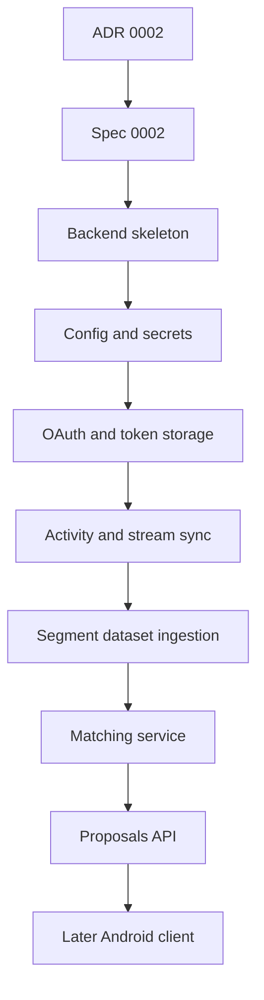

# Task 0012: Prepare Strava B2 Implementation Plan

From version: 0.3.3

Status: Ready

Understanding: 88%

Confidence: 78%

Progress: 0%

Complexity: High

Theme: Backend Planning

## Goal

Convert the Strava B2 architecture decision into a first implementation-ready
plan, without implementing backend code or modifying Android runtime behavior.

## Links

- Request: `docs/request/0008-strava-b2-backend-integration-for-gps-segment-proposals.md`
- ADR: `docs/adr/0002-use-dedicated-strava-b2-backend-for-activity-sync-and-segment-proposals.md`
- Spec: `docs/specs/0001-strava-b2-backend-responsibilities-and-android-contract.md`
- Spec: `docs/specs/0002-strava-b2-backend-architecture-and-data-model.md`
- Derived from `docs/backlog/0044-create-strava-b2-fastapi-backend-skeleton.md`
- Derived from `docs/backlog/0045-add-b2-configuration-and-secret-loading.md`
- Derived from `docs/backlog/0046-add-strava-oauth-and-token-storage.md`
- Derived from `docs/backlog/0047-add-strava-activity-and-stream-sync.md`
- Derived from `docs/backlog/0048-add-segment-dataset-ingestion-for-b2.md`
- Derived from `docs/backlog/0049-add-b2-gps-trace-matching-service.md`
- Derived from `docs/backlog/0050-expose-b2-proposals-api.md`
- Derived from `docs/backlog/0051-add-android-b2-client-integration-later.md`

## Context

The selected B2 direction is a Python FastAPI backend, single-user first, using
SQLite for the initial milestone and environment variables for Strava
configuration. Android remains the final review and confirmation surface.

## Implementation Backlog

Recommended order:

1. `0044` backend skeleton.
2. `0045` configuration and secret loading.
3. `0046` Strava OAuth and token storage.
4. `0047` activity and stream sync.
5. `0048` segment dataset ingestion.
6. `0049` GPS trace matching service.
7. `0050` proposals API.
8. `0051` Android B2 client integration later.

## First Executable Tasks

- `docs/tasks/0013-create-strava-b2-fastapi-backend-skeleton.md`
- `docs/tasks/0014-add-b2-configuration-and-secret-loading.md`
- `docs/tasks/0015-add-strava-oauth-and-token-storage.md`
- `docs/tasks/0016-add-strava-activity-and-stream-sync.md`
- `docs/tasks/0017-add-b2-segment-dataset-ingestion.md`
- `docs/tasks/0018-add-b2-gps-trace-matching-service.md`
- `docs/tasks/0019-expose-b2-proposals-api.md`
- `docs/tasks/0020-add-android-b2-client-integration-later.md`

## Scope

In:

- Review and consolidate B2 docs.
- Record architecture recommendation.
- Draft first implementation backlog.
- Keep implementation tasks bounded but not executed.

Out:

- No backend code.
- No dependencies.
- No Android runtime changes.
- No secrets.
- No commit or push before manual validation.

## Validation

- `git diff --check`
- Search docs for accidental secret-like values.
- Confirm `git status --short --branch` shows documentation-only changes.

## Report

Completed as a planning artifact.

Output:

- Architecture recommendation documented as FastAPI, SQLite, single-user first.
- Technical decision matrix added in spec `0002`.
- Implementation backlog `0044` through `0051` drafted.
- Implementation tasks `0013` through `0020` drafted but not executed.

No backend code, Android runtime code, dependencies, or secrets were added.
