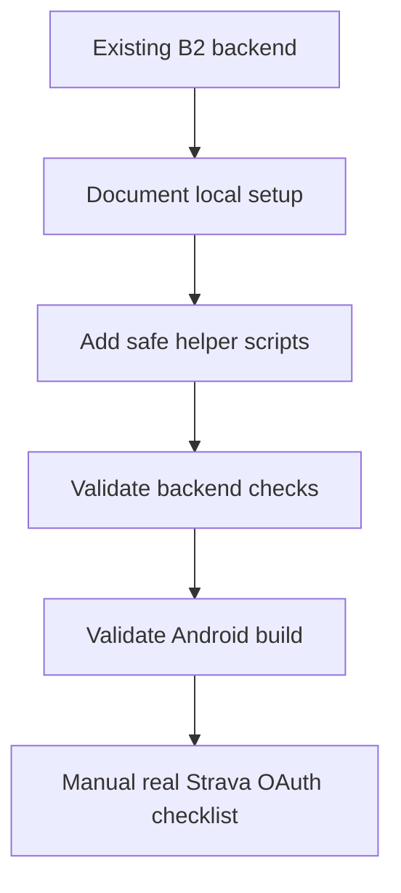

# Task 0021: Validate Strava B2 End-to-End Local Flow

From version: 0.3.3

Status: In Review

Understanding: 92%

Confidence: 86%

Progress: 90%

Complexity: Medium

Theme: Validation

## Goal

Validate the local Strava B2 flow from backend setup to Android proposal review
without adding major runtime features.

## Links

- Follows `docs/tasks/0020-add-android-b2-client-integration-later.md`
- Related backend specs:
  - `docs/specs/0001-strava-b2-backend-responsibilities-and-android-contract.md`
  - `docs/specs/0002-strava-b2-backend-architecture-and-data-model.md`

## Scope

In:

- Local backend setup checklist.
- Segment dataset ingestion validation.
- Backend health/status validation.
- Android backend URL setup validation.
- Android debug build validation.
- Safe helper scripts for local E2E checks.

Out:

- No backend deployment.
- No matching algorithm redesign.
- No automatic Android completion from backend proposals.
- No committed Strava credentials, tokens, local databases, or APK artifacts.

## Execution path

## Acceptance criteria

- A clear local E2E validation workflow exists.
- Backend setup for real Strava testing is documented.
- Android emulator and physical phone URL setup is documented.
- Helper scripts do not contain secrets.
- Existing backend tests pass.
- Android debug APK builds.
- Accepted backend proposals still do not modify local Room completion state.

## Validation

- `python -m compileall backend/app`
- `backend\.venv\Scripts\python.exe -m pytest backend\tests`
- `.\gradlew.bat testDebugUnitTest`
- `.\gradlew.bat assembleDebug`
- `git diff --check`
- secret scan on staged files

## Report

Added local E2E validation workflow documentation and lightweight PowerShell
helpers:

- `backend/scripts/init-local-db.ps1`
- `backend/scripts/run-local-backend.ps1`
- `backend/scripts/e2e-check-local.ps1`

Real Strava OAuth remains a manual validation step because credentials must stay
outside the repository.
