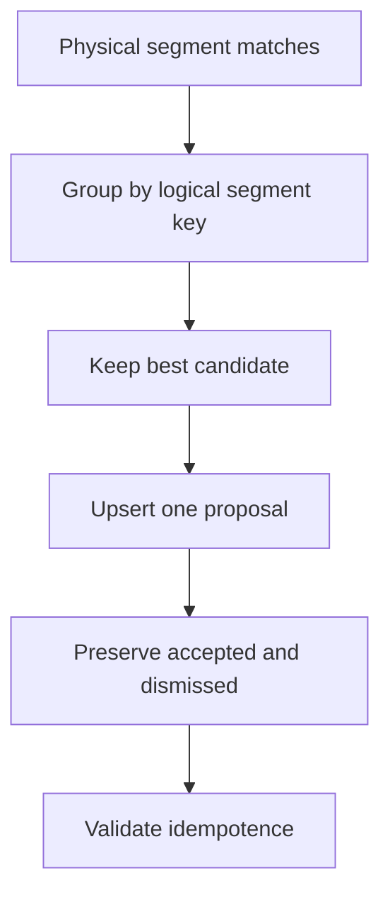

# Task 0022: Fix Duplicate Strava B2 Logical Segment Proposals

From version: 0.3.3

Status: In Review

Understanding: 96%

Confidence: 90%

Progress: 90%

Complexity: Medium

Theme: Backend Reliability

## Goal

Fix proposal generation failures when several physical segment geometries share
the same `logical_segment_id` and match the same Strava activity stream.

## Scope

In:

- Deduplicate proposal candidates by dataset, Strava activity, and logical
  segment.
- Keep the best physical candidate deterministically.
- Preserve the unique database constraint.
- Preserve accepted and dismissed proposals.
- Update proposed proposals only when a new candidate is better.
- Add regression tests.

Out:

- No Android runtime changes.
- No segment dataset changes.
- No matching algorithm redesign.
- No Strava OAuth or sync changes.

## Execution path

## Acceptance criteria

- Proposal generation creates at most one row per logical segment key.
- Duplicate physical matches keep the best candidate.
- Running generation twice does not create duplicates.
- Accepted and dismissed proposals are not overwritten.
- Proposed proposals update only when the new candidate is better.
- Backend tests pass.

## Validation

- `python -m compileall backend/app`
- `backend\.venv\Scripts\python.exe -m pytest backend\tests`
- `git diff --check`
- staged secret and artifact scan

## Report

Implemented a deterministic in-memory candidate selection step before database
upsert. The unique constraint remains unchanged.
