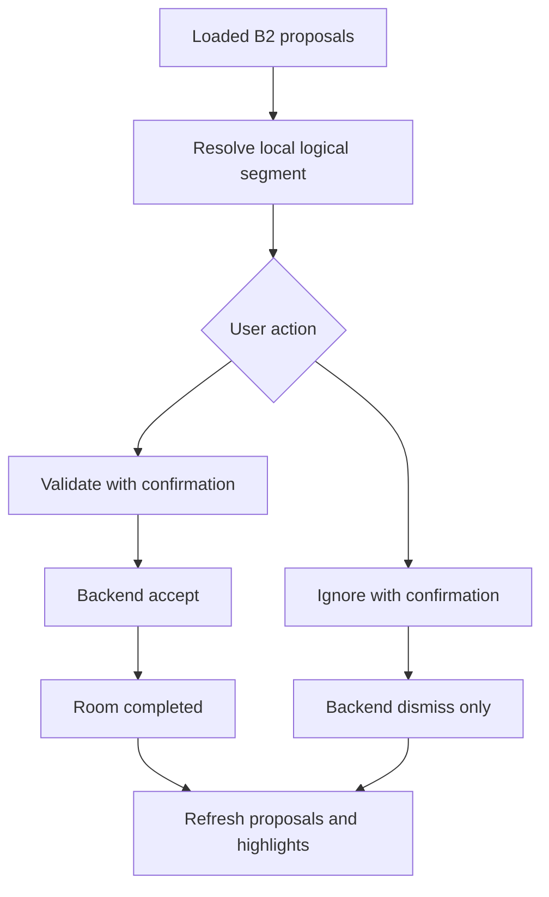

# Task 0023: Harden Android Strava B2 Proposal Validation

From version: 0.3.3

Status: In Review

Understanding: 94%

Confidence: 86%

Progress: 90%

Complexity: High

Theme: Android Integration

## Goal

Harden the Android Strava B2 proposal review flow after real E2E testing.

## Context

Real E2E validation showed that the backend is reachable from the phone, Android
can load proposals, proposed segments are geographically relevant, and orange
map highlights are visible. It also surfaced two UX issues:

- many backend proposals can map to fewer local logical street segments;
- accepting a proposal needs to intentionally update local progress after user
  confirmation.

## Product decision

Accepting a Strava B2 proposal now means:

- accept the backend proposal;
- mark the matching local Android logical segment as completed in Room;
- update local statistics.

This remains user-confirmed validation. The backend never updates Android
progress by itself.

## Scope

In:

- Confirmation before validating one proposal.
- `Tout valider` for currently loaded proposed proposals.
- `Tout ignorer` for currently loaded proposed proposals.
- Local completion update only after explicit validation.
- Proposal-to-local-segment diagnostics.
- Documentation of the post-E2E behavior.

Out:

- No backend deployment.
- No segment dataset change.
- No matching threshold change.
- No backend bulk endpoint yet.

## Execution path

## Acceptance criteria

- Single validation requires confirmation.
- Single validation accepts backend proposal and marks local completion.
- Ignore does not modify local completion.
- Bulk validate requires confirmation and applies only currently loaded proposed
  proposals.
- Bulk ignore requires confirmation and does not modify local completion.
- Unmatched proposals do not crash and are reported.
- Diagnostics explain loaded, matched, unmatched, and highlighted counts.
- Existing manual completion flow remains unchanged.

## Validation

- `.\gradlew.bat testDebugUnitTest`
- `.\gradlew.bat assembleDebug`
- `python -m compileall backend/app`
- `backend\.venv\Scripts\python.exe -m pytest backend\tests`
- `git diff --check`

## Report

Implemented Android-side validation hardening and diagnostics. Android unit test
coverage remains limited because this project currently has no local JVM Android
test harness configured.
